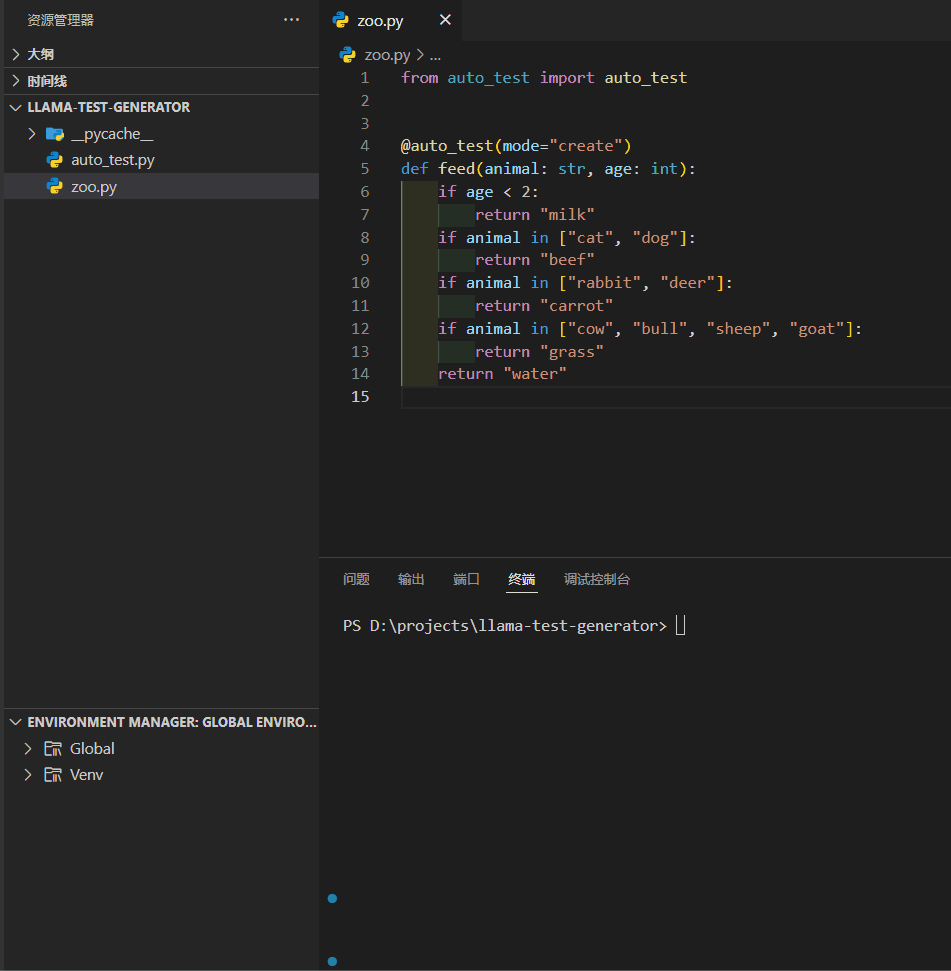

# Llama Test Generator

This repo uses the Meta-Llama-3-8B-Instruct language model to automatically create unit test for python functions. 

**NOTE: The test cases created by the language model may not be appropriate or executable, so manual inspection and revision are necessary.**



## Usage

1. Import `auto_test`.
    ```python
    from auto_test import auto_test
    ```

2. Create a function and decorate `auto_test` on the function.
    ```python
    # zoo.py
    @auto_test
    def feed(animal: str, age: int):
        if age < 2:
            return "milk"
        if animal in ["cat", "dog"]:
            return "beef"
        if animal in ["rabbit", "deer"]:
            return "carrot"
        if animal in ["cow", "bull", "sheep", "goat"]:
            return "grass"
        return "water"
    ```

3. Specify extra options in `auto_test`. Specify `req` with your extra requirements. Specify `overwrite=True` if you hope to overwrite the previous test.
    ```python
    # zoo.py
    @auto_test(req="Mention monkey and bear.", overwrite=True)
    def feed(animal: str, age: int):
        if age < 2:
            return "milk"
        if animal in ["cat", "dog"]:
            return "beef"
        if animal in ["rabbit", "deer"]:
            return "carrot"
        if animal in ["cow", "bull", "sheep", "goat"]:
            return "grass"
        return "water"
    ```

4. Just run the definition of the function (do not need to call the function), and the test will be automatically created and named as `test_zoo_feed.py`.
    ```shell
    python zoo.py
    ```

5. **Review and revise** the unit test in `test_zoo_feed.py` and run the test.
   ```shell
    python test_zoo_feed.py
    ```
